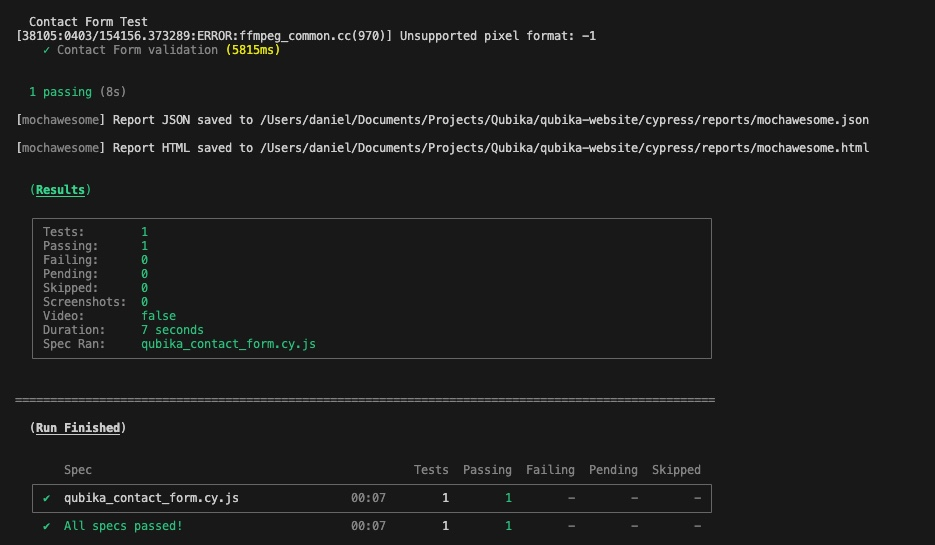

# Contact Form Validation Test

This repository contains an automated test for the **Contact Form** on the Qubika website. The test is built using **Cypress** and ensures that the contact form behaves as expected, performing validation checks on required fields and verifying the correct error messages are displayed.

## Test Overview

The test simulates a user interaction with the Qubika website to ensure that:

1. The website loads correctly and the contact form is accessible.
2. The mandatory fields trigger error messages when left empty.
3. Once some fields are filled out, the form displays appropriate error messages for the remaining empty fields.
4. The form can be closed and reopened with the correct state, including previously entered data.

## Prerequisites

To run this test, you need:

- **Node.js** installed on your machine.
- **Cypress** installed as a development dependency.

### Installation

Clone this repository and navigate into the project folder:

```bash
git clone <repository-url>
cd <project-folder>
```

### Installation
```bash
npm install
```

### Run the tests in headed mode
```bash
npx cypress open
```

### Run the tests in headed mode
```bash
npx cypress run   
```
### Example of a successful run using Mocha reporter in headless mode



